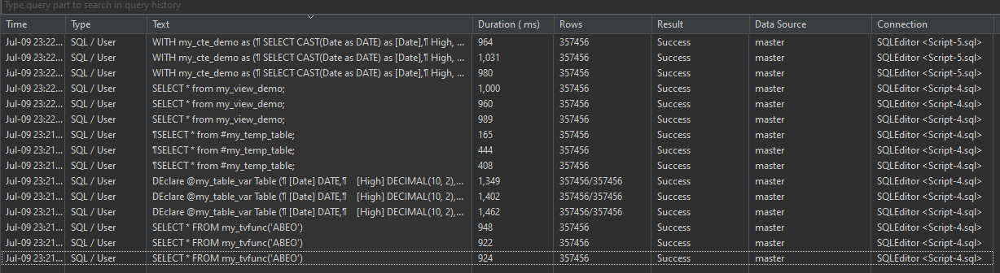

# Comparing CTE, View, Temp Table, Table Variable and TVF 

I'm going to use **SQL Server** for this comparison.

Final result - every 3 rows are the performance of each method: CTE -> View -> Temp Table -> Table Variable -> TVF





## Notes from result:
- **Scope**:
  - `CTE`: Only available in the query where it is defined.
  - `View` & `TVF`: Available in the database schema where it is defined - Physically.
  - `Temp Table`: Available in the session where it is defined.
  - `Table Variable`: Available in the batch where it is defined.

- **Performance** with the same query - about *360000* rows:
  - It seems that `Temp Table` is the fastest (about ~*400 ms*)
  - `CTE`, `View` and `TVF` have similar performance (about ~*1000 ms*)
  - `Table Variable` is the slowest (about ~*1400 ms*), I think it's because it's a variable that is stored in memory and takes time to be created.

- **Indexing**:
  - `Temp Table` and `View` can have indexes.
  - `CTE`, `Table Variable` and `TVF` can't have indexes.

- **Use case**:
  - `CTE`: Readability and **maintainability.**
  - `View`: Security, simplification, abstraction and reusability.
  - `Temp Table`: Store and manipulate intermediate data within sessions or transactions.
  - `Table Variable`: Temporary storage of data that is local to the batch or procedure.
  - `TVF`: Functions that return a table data type.


## SQL Query:

### CTE:
```sql
WITH my_cte_demo as (
	SELECT CAST(Date as DATE) as [Date],
	High, Low,
	(High + Low) / 2.0 as Mid
	FROM master.dbo.NASDAQ WHERE Ticker = 'ABEO'
) 

SELECT * from my_cte_demo;
```

### View:
```sql
CREATE view my_view_demo as (
	SELECT CAST(Date as DATE) as [Date],
	High, Low,
	(High + Low) / 2.0 as Mid
	FROM master.dbo.NASDAQ WHERE Ticker = 'ABEO'
)


SELECT * from my_view_demo;
```

### Temp Table:
```sql
DROP Table #my_temp_table;

SELECT CAST(Date as DATE) as [Date],
High, Low,
(High + Low) / 2.0 as Mid
Into #my_temp_table
FROM master.dbo.NASDAQ WHERE Ticker = 'ABEO'


SELECT * from #my_temp_table;
```

### Table Variable:
```sql
DEclare @my_table_var Table (
	[Date] DATE,
    [High] DECIMAL(10, 2),
    [Low] DECIMAL(10, 2),
    [Mid] AS ([High] + [Low]) / 2.0
);

INSERT INTO @my_table_var 
SELECT CAST(Date as DATE) as [Date],
High, Low
FROM master.dbo.NASDAQ WHERE Ticker = 'ABEO';


SELECT * FROM @my_table_var;
```

### TVF:
```sql
CREATE FUnction my_tvfunc (@ticker nvarchar(20)) 
RETURNS TABLE 
AS
Return (
SELECT CAST(Date as DATE) as [Date],
	High, Low,
	(High + Low) / 2.0 as Mid
FROM master.dbo.NASDAQ WHERE Ticker = @ticker
);


SELECT * FROM my_tvfunc('ABEO')
```